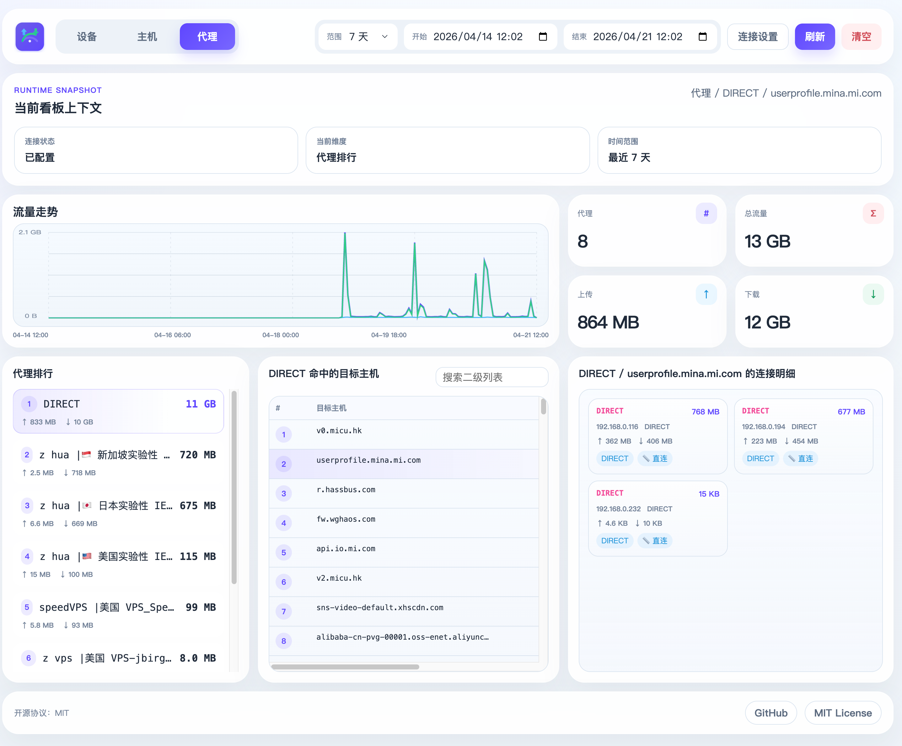

# Traffic Monitor

`Traffic Monitor` 是一个独立运行的 Mihomo 流量监控服务。

它会定时读取 Mihomo 的 `/connections` 数据，把流量增量写入 SQLite，并提供一个内置 Web 页面，用来查看设备、主机、代理维度的流量统计和链路明细。

## 怎么用

### 本地运行

```bash
go build -o traffic-monitor main.go
MIHOMO_URL=http://127.0.0.1:9090 ./traffic-monitor
```

启动后访问：

```text
http://localhost:8080/
```

### Docker 运行

```bash
mkdir -p data

docker run -d \
  --name traffic-monitor \
  --restart unless-stopped \
  -p 8080:8080 \
  -e MIHOMO_URL=http://host.docker.internal:9090 \
  -e MIHOMO_SECRET=your-secret \
  -e TRAFFIC_MONITOR_DB=/data/traffic_monitor.db \
  -v "$(pwd)/data:/data" \
  zhf883680/clash-traffic-monitor:latest
```

如果 Mihomo 没有设置密钥，可以把 `MIHOMO_SECRET` 留空。

## 常用配置

| 变量名 | 默认值 | 说明 |
| --- | --- | --- |
| `MIHOMO_URL` | `http://127.0.0.1:9090` | Mihomo Controller 地址 |
| `MIHOMO_SECRET` | 空 | Mihomo Bearer Token |
| `TRAFFIC_MONITOR_LISTEN` | `:8080` | 服务监听地址 |
| `TRAFFIC_MONITOR_DB` | `./traffic_monitor.db` | SQLite 数据库路径 |
| `TRAFFIC_MONITOR_POLL_INTERVAL_MS` | `2000` | 采集间隔，单位毫秒 |
| `TRAFFIC_MONITOR_RETENTION_DAYS` | `30` | 数据保留天数 |

同时兼容旧变量：`CLASH_API`、`CLASH_SECRET`。

## 页面预览



## 备注

因为这个项目主要运行在 OpenWrt 环境，当前默认移除了进程维度相关展示。

如果你需要进程模块，可以在此基础上自行 fork 后补充。

## 致谢

页面接口参考了 [MetaCubeX/metacubexd](https://github.com/MetaCubeX/metacubexd)。
